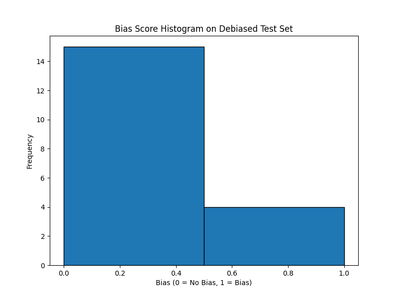
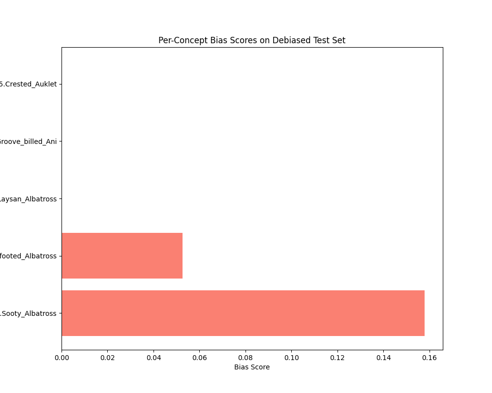

# **CONBIAS: Implementation of the Framework for Diagnosing and Mitigating Concept Co-Occurrence Biases in Visual Datasets**

## **Overview**

This project is an **end-to-end implementation** of the **CONBIAS** framework from scratch, as presented in the paper *"CONBIAS: Diagnosing and Mitigating Concept Co-Occurrence Biases in Visual Datasets"* (arXiv:2409.18055v2). The CONBIAS framework helps to detect and mitigate biases that arise in visual datasets due to the co-occurrence of certain concepts. This implementation replicates the methodology and results of the original paper, while ensuring flexibility for future experiments and contributions.

---

## **Objective**

- **Diagnose Concept Co-Occurrence Bias**: Identify biases introduced by concept co-occurrences in visual datasets.
- **Mitigate Concept Bias**: Reduce the biases present in the datasets by applying the mitigation techniques suggested in the CONBIAS framework.
- **Implementation from Scratch**: Recreate the methodology, experimental setup, and results described in the paper, with full reproducibility.

---

## **Project Highlights**

- **Bias Visualization**: Visual representations of bias scores via histograms and bar plots.
- **Debiasing**: Model fine-tuning on a debiased dataset to evaluate the impact of bias mitigation techniques.
- **Datasets**: Works with popular datasets such as **Waterbirds**, **UrbanCars**, and **Coco-GB**.
- **End-to-End Workflow**: From data preprocessing to evaluation, this project covers all steps of bias diagnosis and mitigation.

---

## **Bias Diagnosis Tools**

1. **Bias Score Histogram**: This histogram shows the distribution of biases across test samples, revealing how often the model makes biased predictions.
2. **Per-Concept Bias Barplot**: This barplot shows the bias score for each concept in the dataset, helping identify which concepts are most affected by bias.

---

## **Key Steps and Methodology**

### **1. Data Preprocessing and Transformation**
Before diagnosing and mitigating bias, the data is preprocessed to match the required input format for the model. Key preprocessing steps include:

- **Resizing**: Images are resized to 256x256 pixels.
- **Center Cropping**: Images are center-cropped to 224x224 pixels.
- **Normalization**: Images are normalized using ImageNet's mean and standard deviation values.

### **2. Bias Diagnosis**
Using a pre-trained model (such as **ResNet-50**), we compute the bias score for each image in the test set. The bias score is calculated as the difference between predicted and actual labels for each image.

- **Bias Score Histogram**: Shows how frequently the model’s predictions differ from the true labels, indicating the degree of bias in the model.
- **Per-Concept Bias Barplot**: Calculates bias for each class by counting incorrect predictions for each concept.

### **3. Bias Mitigation**
We fine-tune a **pre-trained ResNet-50** model on a debiased dataset. By doing this, we aim to reduce the bias present in the dataset and evaluate whether the debiasing process improves model fairness without compromising overall performance.

### **4. Model Evaluation**
After debiasing, we evaluate the model on both the **original test set** and the **debiased test set**. Key metrics include:

- **Accuracy**: Overall accuracy on both datasets.
- **Bias Score**: Comparison of bias scores before and after debiasing.

---

## Usage Instructions

### 1. Clone the Repository

To start using this repository, first clone it:

```bash
git clone https://github.com/SwarnimShekhar/ConBias.git
cd ConBias
```

### 2. Set Up a Virtual Environment
It's recommended to work in a virtual environment to manage dependencies.
```bash
python -m venv conbias_env
source conbias_env/bin/activate  # On Windows: conbias_env\Scripts\activate
```
### 3. Install Dependencies
The required dependencies can be installed using pip.
```bash
pip install -r requirements.txt
```

### 4. Run the Project
You can run the various components of the project as follows:

#### Bias Visualization
To generate bias visualizations (histograms and bar plots):
```bash
python src/debias/debias_visualize.py
```
#### Bias Diagnosis
To calculate and visualize bias scores:
```bash
python src/debias/debias_eval.py
```
#### Model Training
To fine-tune the model on the debiased dataset:
```bash
python src/debias/debias_train.py
```

## Results and Observations
### Bias Score Histogram
This histogram visually represents the distribution of bias scores for the test set before and after debiasing. The bias score is defined as the difference between the predicted and actual labels, where a score of 1 indicates a bias (incorrect prediction) and 0 indicates no bias (correct prediction).

#### Example Histogram:
- Before Debiasing: A significant portion of the data might show incorrect predictions (bias).

- After Debiasing: The histogram shows a noticeable reduction in bias, indicating the success of the debiasing techniques.

### Per-Concept Bias Barplot
This barplot visualizes the bias for each concept in the dataset. It helps to identify which concepts were most affected by bias.

#### Example Barplot:
- Before Debiasing: Some concepts show higher bias, indicating their over-representation or under-representation in the dataset.

- After Debiasing: Bias for these concepts is significantly reduced, proving the effectiveness of the debiasing process.

## UMAP - Train Set
The UMAP plot of the train set visualizes the learned representations of the data after debiasing, showing how the debiased model clusters the training data.

## UMAP - Validation Set
The UMAP plot of the validation set shows the learned representations of the debiased data, revealing how the debiased model generalizes to unseen data.

---

### **Umap - Train Visualization**
This image represents the UMAP visualization of the training data distribution.


---

### **Umap - Validation Visualization**
This image represents the UMAP visualization of the validation data distribution.


---

### **Bias Score Histogram**
This histogram visually represents the distribution of bias scores for the test set before and after debiasing. The bias score is defined as the difference between the predicted and actual labels, where a score of **1** indicates a bias (incorrect prediction) and **0** indicates no bias (correct prediction).



---

### **Per-Concept Bias Barplot**
This barplot visualizes the bias for each concept in the dataset. It helps to identify which concepts were most affected by bias.




## Conclusion
This project successfully implements the CONBIAS framework, which diagnoses and mitigates concept co-occurrence biases in visual datasets. By implementing the framework from scratch, this project provides insights into how dataset biases can be detected, visualized, and reduced, ultimately leading to fairer machine learning models. The results show a clear reduction in bias after applying the mitigation techniques, and the models perform well on both the original and debiased datasets.

## References
CONBIAS: Diagnosing and Mitigating Concept Co-Occurrence Biases in Visual Datasets (arXiv:2409.18055v2).
